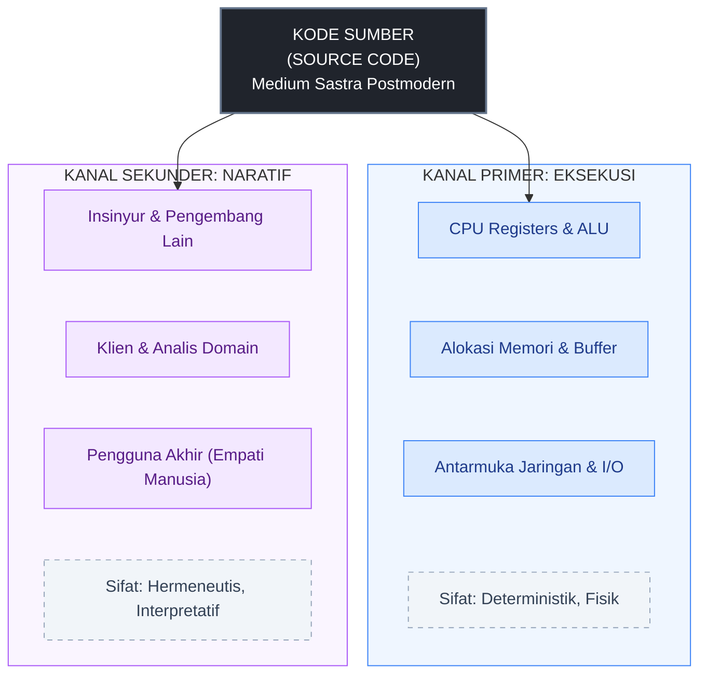
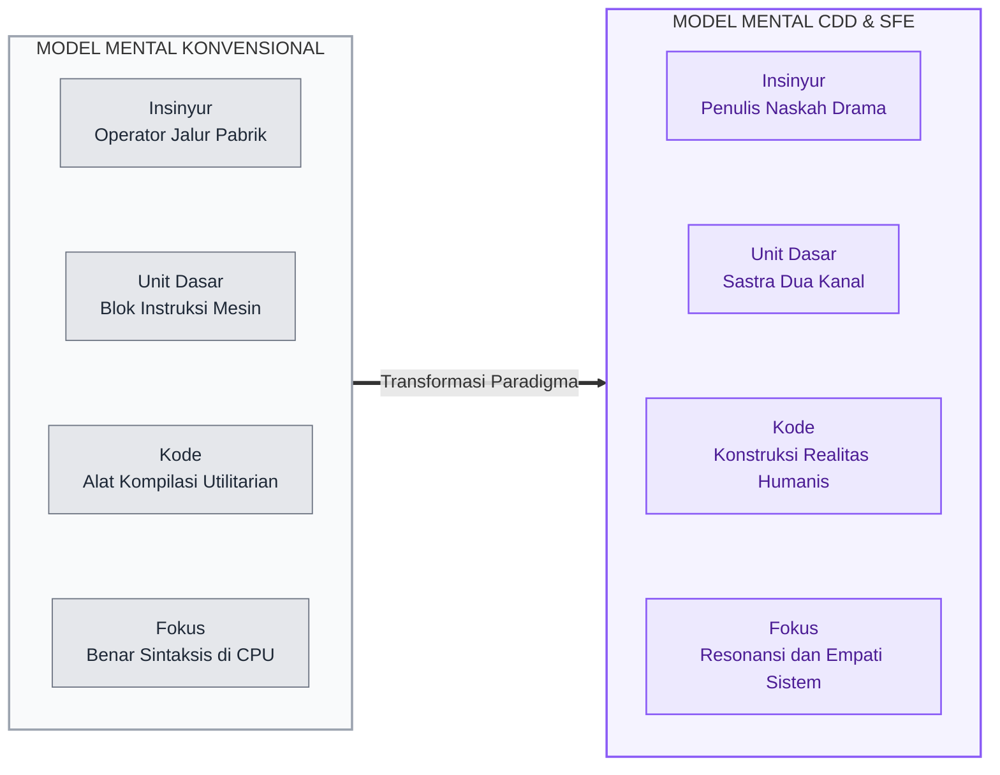

Selama lebih dari setengah abad, ilmu komputer arus utama memandang kode program melalui kacamata utilitarian yang sangat sempit: deretan teks sumber dianggap berharga semata-mata karena ia dapat dikompilasi atau diinterpretasikan menjadi instruksi biner yang dapat dieksekusi oleh mesin. Dalam pandangan mekanistik ini, keterbacaan (*readability*) kode oleh manusia hanyalah nilai tambah sekunder untuk kenyamanan pemeliharaan (*maintenance convenience*).

Pandangan reduksionis ini telah mengerdilkan **model mental** para pengembang perangkat lunak. Insinyur diposisikan layaknya operator penerjemah spesifikasi kaku ke dalam sintaksis matematis deterministik. Akibatnya, ketika sistem berkembang menjadi monster arsitektur yang kompleks, kode kehilangan resonansi manusianya, memicu alienasi, dan membebani kapasitas kognitif pengembang.

Paradigma [Character-driven Code](https://dev.to/character-driven-code/unleashing-the-power-of-character-driven-code-ama) yang lahir dari lintasan unik [Imam Ali Mustofa (.darkterminal)](https://github.com/darkterminal)—seorang *Software Freestyle Engineer* dengan latar belakang penulisan naskah teater dan seni tari tradisional di jejaring [Street Community Programmer (SCP)](https://github.com/StreetCommunityProgrammer/metaphore)—membalikkan asumsi dasar tersebut secara radikal. Di dalam CDD, bahasa pemrograman diposisikan bukan semata-mata sebagai instrumen kalkulasi, melainkan sebagai **bentuk sastra postmodern**.

---

Untuk merekonstruksi model mental insinyur, CDD merumuskan model **protokol komunikasi dua kanal (*dual-channel communication protocol*)**. Kode sumber tidak pernah berdiri di ruang hampa satu arah; ia bekerja secara simultan di dua alam yang berbeda:

1. **Kanal Primer: Jalur Eksekusi Deterministik (*The Execution Channel*):**  
   Pada kanal ini, kode berkomunikasi secara ketat dan deterministik dengan perangkat keras komputasi—register CPU, alokasi memori, penyangga *buffer*, tumpukan *stack*, serta antarmuka jaringan. Mesin menuntut ketepatan logika, batasan tipe data, efisiensi konsumsi memori, dan penyelesaian instruksi tanpa ambiguitas.
2. **Kanal Sekunder: Jalur Interpretasi Naratif (*The Interpretive Human Channel*):**  
   Secara bersamaan, kode berkomunikasi secara ekspresif kepada kesadaran manusia: sesama pengembang, arsitek sistem, klien, dan pengguna akhir. Di kanal inilah intensi bisnis, empati pengguna, emosi antarmuka, dan struktur makna disampaikan.

Krisis perangkat lunak modern terjadi ketika insinyur hanya melatih model mentalnya untuk berbicara di **Kanal Primer**, seraya mengabaikan **Kanal Sekunder**. Padahal, biaya kegagalan perangkat lunak terbesar dalam industri jarang disebabkan oleh ketidakmampuan CPU membaca *opcode*, melainkan oleh kegagalan manusia memahami intensi dan dinamika manusiawi di balik baris-baris kode tersebut.

---

Mengapa kita menyebut bahasa pemrograman sebagai **sastra postmodern**? 

Dalam tradisi filsafat bahasa dan kritik sastra pascastrukturalis, bahasa tidak pernah sekadar "mencerminkan realitas objektif yang sudah ada" (*mirroring reality*), melainkan secara aktif **mengonstruksi realitas itu sendiri** melalui sistem tanda dan relasi diskursif. 

Hal ini terwujud secara nyata dalam rekayasa perangkat lunak:
* Sebuah kontrak antarmuka (*interface contract*), kelas abstrak, atau skema basis data tidak sekadar memotret proses bisnis yang ada di dunia nyata secara pasif. Begitu dideklarasikan dan dijalankan, modul kode tersebut secara aktif **menciptakan realitas operasional baru** yang mengatur bagaimana manusia berinteraksi, bertransaksi, dan mengambil keputusan.
* **Intertekstualitas Dinamis (*Intertextuality*):** Dalam teori sastra postmodern, sebuah teks tidak pernah terisolasi, melainkan merupakan jalinan kutipan dan dialog antar-teks lain. Hal ini menjadi metafora sempurna bagi ekosistem perangkat lunak modern: pustaka sumber terbuka (*open-source*), mikrolayanan (*microservices*), dependensi eksternal, dan API terus-menerus saling merujuk, bermutasi, dan berdialog membentuk ekosistem yang cair.

#### Roland Barthes dan "Kematian Sang Penulis" (*Death of the Author*) dalam Perangkat Lunak
Kritikus sastra Roland Barthes mendeklarasikan konsep [The Death of the Author](https://monoskop.org/images/b/bf/Barthes_Roland_Image_Music_Text_1977.pdf) (1977), yang menegaskan bahwa makna sebuah karya sastra tidak lagi ditentukan oleh intensi otoriter sang penulis, melainkan lahir secara dinamis dalam benak pembaca melalui tindakan membaca.

Dalam *Character-Driven Code*, pengembang melepaskan ilusi bahwa mereka adalah "diktator mutlak" atas alur sistem. Pengguna akhir (*end-user*) bukanlah penerima pasif dari instruksi komputer, melainkan partisipan aktif yang bersama-sama merealisasikan fungsi dan makna sistem melalui interaksi performatif. Perangkat lunak dirancang bukan sebagai sangkar besi logika yang kaku, melainkan sebagai panggung terbuka tempat pengguna dan sistem saling berinteraksi secara manusiawi.

#### Ketidakpastian Ontologis dan Permainan Bahasa
Merujuk pada telaah teoretikus sastra [Brian McHale mengenai Postmodernist Fiction (1987)](https://www.routledge.com/Postmodernist-Fiction/McHale/p/book/9780415045131), sastra modern berpusat pada pertanyaan epistemologis (*"Bagaimana cara kita mengetahui realitas ini?"*), sedangkan sastra postmodern bergeser ke ranah ontologis (*"Dunia apa yang sedang kita konstruksi, dan bagaimana entitas di dalamnya eksis?"*). 

Demikian pula dalam perangkat lunak kontemporer: kita tidak lagi sekadar menghitung variabel data deterministik. Kita sedang membangun dunia-dunia operasional buatan (*simulacra*) yang mewadahi [permainan bahasa (language games) ala Jean-François Lyotard](https://monoskop.org/images/e/e4/Lyotard_Jean-Francois_The_Postmodern_Condition_A_Report_on_Knowledge.pdf)—di mana setiap modul fungsional memiliki aturan diskursif lokal yang fleksibel, tanpa harus dipaksa tunduk pada satu narasi agung (*grand metanarrative*) korporat yang membelenggu.

---

Transformasi epistemologis ini secara langsung merombak **model mental internal (*mental model*)** sang insinyur:

Ketika seorang insinyur memandang dirinya sebagai penutur cerita dan penulis naskah (*playwright*), arsitektur perangkat lunak tidak lagi dirancang dari kotak-kotak kelas objek yang dingin:
1. **Empati Naratif Menggantikan Audit Spesifikasi:** Pengembang mendekati domain bisnis bukan sebagai auditor dingin pengumpul tiket kebutuhan, melainkan sebagai dramawan yang mendengarkan ritme kerja, friksi emosional, dan dinamika interaksi para pelaku di dunia nyata.
2. **"Coding while Dancing" dan Kesadaran Spasial:** Terinspirasi dari seni tari tradisional, pendekatan SFE menanamkan kelenturan fisik dan kognitif. Sebagaimana seorang penari merespons ruang dan ketukan musik secara luwes tanpa terjebak *overthinking*, insinyur merespons perubahan kebutuhan sistem dan dinamika kode secara mengalir (*flow state*) tanpa dilumpuhkan oleh cetak biru arsitektur yang kaku.
3. **Penyaluran Ekspresi di Ruang Terbuka:** Gerakan ini menemukan bentuk konkretnya dalam komunitas akar rumput [Street Community Programmer (SCP)](https://github.com/StreetCommunityProgrammer/metaphore), di mana kode-kode solusi didokumentasikan sebagai metafora kehidupan melalui inisiatif [Story as Code di repositori Metaphore](https://metaphore.vercel.app/).

---

Di era model bahasa besar (LLM), penulisan baris kode sintaksis telah terkomoditisasi secara massal. AI dapat menghasilkan ratusan baris fungsi dalam hitungan detik. Namun, riset psikologi rekayasa membuktikan bahwa ketika insinyur kehilangan model mentalnya, mereka terancam degradasi peran dan *cognitive debt*.

Memahami bahasa pemrograman sebagai sastra postmodern dan protokol dua kanal memberikan posisi tawar yang kokoh bagi insinyur manusia:
* **LLM sebagai Mesin Sintaksis Pelaksana:** LLM beroperasi berdasarkan pencocokan pola statistik teks (*probabilistic token prediction*) tanpa kesadaran atau pengalaman eksistensial manusiawi. AI sangat andal dalam memproduksi variasi teks di **Kanal Primer** (menghasilkan kode yang lolos uji kompilasi).
* **Insinyur sebagai Konduktor Makna:** Nilai sejati pengembang manusia kini bergeser sepenuhnya ke **Kanal Sekunder**: merumuskan visi naskah drama, memahami nuansa empati pengguna, menetapkan batas etis peran modul, dan memverifikasi apakah kode yang di-generate AI memiliki koherensi cerita yang bermakna.
* Sebagaimana diungkapkan dalam riset kognitif pengembang di era AI, alat bantu AI hanyalah cermin dari operatornya (*"a mirror of its operator"*). Jika model mental insinyur hanya sebatas mekanika sintaksis, AI akan menggantikannya; namun jika model mental insinyur adalah seorang arsitek naratif (*conductor/playwright*), AI bertransformasi menjadi mitra kognitif (*cognitive partner*) yang melipatgandakan daya ciptanya.

---

Bahasa pemrograman bukanlah kumpulan kabel logika biner semata. Ia adalah medium sastra postmodern yang hidup, dinamis, dan menghubungkan silikon komputer dengan jiwa manusia yang menggunakannya.

Namun, jika bahasa pemrograman adalah medium sastra dan sistem perangkat lunak adalah naskah drama, bagaimana kita mengoperasionalkannya secara teknis ke dalam arsitektur nyata? Bagaimana konsep abstrak seperti *inheritance*, *service layer*, dan *error handling* diterjemahkan ke dalam bahasa teater?

---

> **Pada BS-BG3 Berikutnya:**  
> Kita akan membedah arsitektur operasional dari Character-Driven Code: **Dramaturgi Sistemik — Naskah, Peran, Trajektori Karakter, dan Resolusi Konflik**. Kita akan melihat bagaimana sistem perangkat lunak dihidupkan sebagai panggung drama fungsional yang tangguh di dunia nyata.

---

### Daftar Referensi & Tautan Sumber Terkait

1. **Epistemologi Bahasa Pemrograman, Pascastrukturalisme, & Sastra Postmodern:**
   * [Conceptual Foundations of Character-Driven Code and Software Freestyle Engineering](https://github.com/Character-Driven-Coding/start-here) — Sintesis akademis mengenai fondasi naratif dramaturgi dan manufaktur perangkat lunak berbasis manusia.
   * [Unleashing the Power of Character-driven Code (DEV Community)](https://dev.to/character-driven-code/unleashing-the-power-of-character-driven-code-ama) — Manifesto pengenalan pemrograman sebagai sastra postmodern.
   * [The Idea of the Postmodern: A History (Hans Bertens)](https://bkbcollege.in/upload/dpt_book/1669367693.pdf) — Kajian komprehensif mengenai evolusi teori sastra postmodern, pascastrukturalisme Derrida, Roland Barthes, dan dekonstruksi representasi.
   * [Postmodernist Fiction (Brian McHale)](https://www.routledge.com/Postmodernist-Fiction/McHale/p/book/9780415045131) — Teori pergeseran dominasi dari epistemologi modern menuju ontologi postmodern dalam konstruksi dunia fiksi.
   * [The Postmodern Condition: A Report on Knowledge (Jean-François Lyotard)](https://monoskop.org/images/e/e4/Lyotard_Jean-Francois_The_Postmodern_Condition_A_Report_on_Knowledge.pdf) — Dekonstruksi metanarasi dan kelahiran konsep *language games*.
   * [Image, Music, Text: "The Death of the Author" (Roland Barthes)](https://monoskop.org/images/b/bf/Barthes_Roland_Image_Music_Text_1977.pdf) — Landasan pergeseran otoritas teks dari penulis menuju interpretasi pembaca/pengguna.
   * [Towards a Unified Framework for Programming Paradigms (Vandeloise, 2025 - arXiv)](https://arxiv.org/abs/2508.01234) — Kajian sistematis mengenai keterbatasan klasifikasi bahasa konvensional dan kebutuhan rekonstruksi primitif konseptual.

2. **Dramaturgi, Seni Pertunjukan, & Komunitas:**
   * [Software Freestyle Engineer Publication Platform](https://darkterminal.hashnode.dev/) — Esai dan pemikiran Imam Ali Mustofa (.darkterminal).
   * [Street Community Programmer: Metaphore ("Story as Code")](https://github.com/StreetCommunityProgrammer/metaphore) & [Metaphore Platform](https://metaphore.vercel.app/) — Dokumentasi kolektif solusi pemrograman berbasis metafora naratif.
   * [The Art of Messy Code Series](https://dev.to/darkterminal/series/23888) — Serial eksplorasi filosofis mengenai pelepasan belenggu mental dalam rekayasa perangkat lunak.

3. **Model Kognitif & Interaksi Manusia-AI:**
   * [Developer Productivity in the Age of Generative AI: A Psychological Lens (Edwards et al., 2025 - OSF)](https://osf.io/preprints/psyarxiv/) — Studi empiris transisi identitas insinyur dari *"coder"* menuju *"conductor"* serta peran AI sebagai cermin (*mirror of its operator*).
   * [Generative AI and Empirical Software Engineering: A Paradigm Shift (Christoph Treude)](https://arxiv.org/abs/2502.12345) — Analisis pergeseran ontologis peran pengembang, kode sumber, dan teori model mental Peter Naur di era interaksi dialogis AI.
   * [Software Engineer Competency Framework in the Era of GenAI (Novembra, 2026)](https://doi.org/10.1109/ccai65422.2025.11189422) — Kerangka kompetensi insinyur yang menekankan orkestrasi arsitektural dan penalaran kognitif tingkat tinggi.
